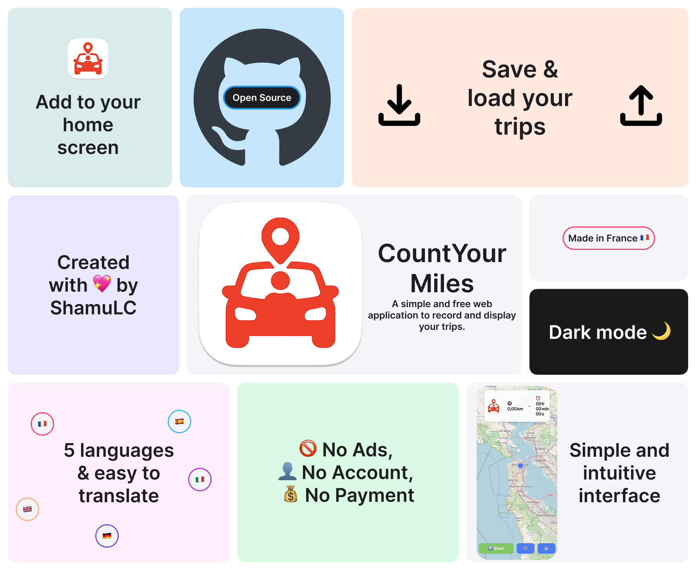

# CountYourMiles



*Made with [Apple Summary Slide Template](https://www.figma.com/community/file/1116337874011756261/apple-summary-slide-template)*

A **simple** and **free** web application to record and display your trips, whether on foot, by bike, or by car.

## ✨ Features
- 📍 **Live GPS tracking** of your route  
- 📏 **Distance and duration calculations**  
- 💾 **Saving and reloading trips** (JSON files)  
- 🌙 **Dark mode toggle** for better readability  
- 🌍 **Multi-language support** (🇫🇷/🇬🇧/🇪🇸/🇩🇪/🇮🇹)
- 💰 **No ads**, **no accounts**, everything in your browser

## 🚀 Installation
1. **Clone this repository**:
    ```bash
    git clone https://github.com/ShamuCode/CountYourMiles.git
    ```
2. **Navigate into the folder**:
    ```bash
    cd CountYourMiles
    ```
3. **Launch a local server** or open `index.html` directly in your browser to explore.

## 🛠️ Usage
1. **Open the application** in a modern browser.
2. **Grant location permissions** when prompted.
3. Click **“Start”** to begin tracking.
4. Use **“Stop”** and **“Resume”** to control recording.
5. **Save or load routes** via file input/output.

## 🤝 Contributing
1. **Fork the project** and create your branch.
2. **Commit changes** with clear messages.
3. **Push to your fork** and create a Pull Request.

## 📜 License
This project is **open-sourced** under the **MIT License**. Feel free to use, modify, and distribute following the license terms.